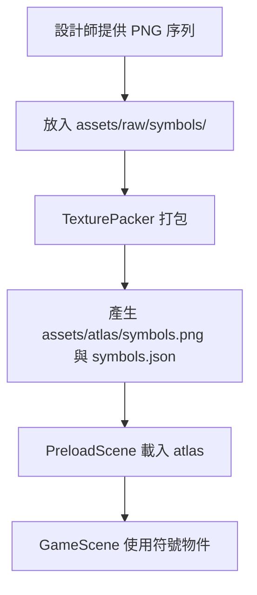

# 🎮 2026 Game Frontend Learning Repository

這是用於學習 HTML5 遊戲前端開發的專案儲存庫，目前主要聚焦於使用 **Phaser 3** 與 **GSAP** 練習遊戲開發，目前有星星收集練習專案（Collect Stars）與大老二（Big Two），未來會延伸到老虎機。

---

## 🛠️ 技術棧

- **建置工具**: [Vite](https://vitejs.dev/) (v8.1.5)
- **程式語言**: [TypeScript](https://www.typescriptlang.org/) (v6.0.2)
- **遊戲引擎**: [Phaser 3](https://phaser.io/) (v3.90.0)
- **動畫庫**: [GSAP](https://gsap.com/) (v3.15.0)

---

## 📂 專案結構

```bash
.
├── assets/                  # 全局靜態資源
├── game-analysis/           # 遊戲邏輯與數值分析相關文檔
├── notes/                   # 學習與開發筆記
│   └── day00.md             # 環境建置與工作流說明
└── projects/                # 實作專案目錄，每個都是獨立的 Vite 專案
    ├── collect-stars/       # 星星收集練習專案（Day01 官方範例延伸，dev port 5173）
    │   └── src/scenes/      # BootScene → PreloadScene → GameScene
    └── big-two/             # 大老二（Scene 骨架已建立，玩法未開始，dev port 5174）
```

想一次看到所有專案的進度與連結，直接用瀏覽器打開根目錄的 `index.html`（純靜態 dashboard）。

---

## 🚀 快速開始

### 1. 複製專案

```bash
git clone <repository-url>
cd 2026-game-frontend-learning-repository
```

### 2. 啟動 Collect Stars 專案

```bash
cd projects/collect-stars
npm install
npm run dev
```

啟動後瀏覽器開啟 `http://localhost:5173` 即可遊玩與測試。

---

## 🎨 美術資源處理流程 (TexturePacker)

在開發 Collect Stars 時，建議使用 TexturePacker 將符號 (Symbols) 合併為圖集 (Sprite Sheet) 以優化效能：



詳細的開發環境設定與 TexturePacker 流程說明，請參考 [Day00 環境建置筆記](file:///Users/user/Documents/kuku/2026-game-frontend-learning-repository/notes/day00.md)。

---

## 📝 學習與開發日誌

- [day00.md](file:///Users/user/Documents/kuku/2026-game-frontend-learning-repository/notes/day00.md) - 開發環境建置、Phaser/GSAP 版本確認與 TexturePacker 建議工作流。
