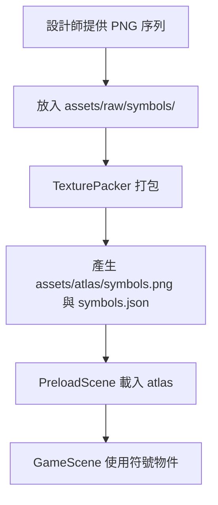

# 🎮 2026 Game Frontend Learning Repository

這是用於學習 HTML5 遊戲前端開發的專案儲存庫，目前主要聚焦於使用 **Phaser 3** 與 **GSAP** 開發老虎機（Slot Game）遊戲。

---

## 🛠️ 技術棧

- **建置工具**: [Vite](https://vitejs.dev/) (v8.1.5)
- **程式語言**: [TypeScript](https://www.typescriptlang.org/) (v6.0.2)
- **遊戲引擎**: [Phaser 3](https://phaser.io/) (v3.90.0)
- **動畫庫**: [GSAP](https://gsap.com/) (v3.15.0)

---

## 📂 專案結構

```bash
.
├── assets/                  # 全局靜態資源
├── game-analysis/           # 遊戲邏輯與數值分析相關文檔
├── notes/                   # 學習與開發筆記
│   └── day00.md             # 環境建置與工作流說明
└── projects/                # 實作專案目錄
    └── slot-game/           # 老虎機（Slot Game）主專案
        ├── src/             # 遊戲原始碼
        │   ├── assets/      # 專案內部資源
        │   ├── config/      # 遊戲設定
        │   ├── managers/    # 管理器（音效、狀態等）
        │   ├── objects/     # 遊戲物件（Reel, Symbol 等）
        │   ├── scenes/      # 場景（Boot, Preload, GameScene 等）
        │   ├── ui/          # UI 元件
        │   └── game.ts      # 遊戲主入口
        └── package.json
```

---

## 🚀 快速開始

### 1. 複製專案

```bash
git clone <repository-url>
cd 2026-game-frontend-learning-repository
```

### 2. 啟動 Slot Game 專案

```bash
cd projects/slot-game
npm install
npm run dev
```

啟動後瀏覽器開啟 `http://localhost:5173` 即可遊玩與測試。

---

## 🎨 美術資源處理流程 (TexturePacker)

在開發 Slot Game 時，建議使用 TexturePacker 將符號 (Symbols) 合併為圖集 (Sprite Sheet) 以優化效能：



詳細的開發環境設定與 TexturePacker 流程說明，請參考 [Day00 環境建置筆記](file:///Users/user/Documents/kuku/2026-game-frontend-learning-repository/notes/day00.md)。

---

## 📝 學習與開發日誌

- [day00.md](file:///Users/user/Documents/kuku/2026-game-frontend-learning-repository/notes/day00.md) - 開發環境建置、Phaser/GSAP 版本確認與 TexturePacker 建議工作流。
