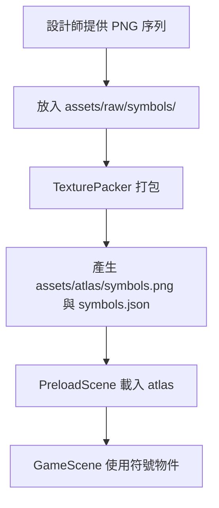

# 2026 Game Frontend Learning Repository

個人 HTML5 遊戲前端學習 repo，用 **Phaser 3** 與 **GSAP** 練習遊戲開發。學習方式是每天在 `notes/dayXX.md` 記錄當日目標、學到的 API、除錯歷程與反思，目前主要在 `projects/collect-stars/`（星星收集練習專案）累積實作進度，未來會擴充到大老二（`projects/big-two/`）與老虎機等專案。

## 技術棧

| 類別 | 工具 | 版本 |
|------|------|------|
| 建置工具 | [Vite](https://vitejs.dev/) | ^8.1.1 |
| 語言 | [TypeScript](https://www.typescriptlang.org/) | ~6.0.2 |
| 遊戲引擎 | [Phaser 3](https://phaser.io/) | ^3.90.0 |
| 動畫庫 | [GSAP](https://gsap.com/) | ^3.15.0 |
| 圖集打包 | TexturePacker（線上版） | - |

目前**未**引入測試框架、ESLint、Prettier（詳見 [TESTING.md](./TESTING.md)）。

## 快速開始

```bash
git clone <repository-url>
cd 2026-game-frontend-learning-repository/projects/collect-stars
npm install
npm run dev
```

啟動後開啟 `http://localhost:5173` 遊玩／測試。

## 常用指令

| 指令 | 說明 |
|------|------|
| `npm run dev` | 啟動 Vite 開發伺服器（HMR） |
| `npm run build` | `tsc` 型別檢查後執行 `vite build` |
| `npm run preview` | 預覽 production build |

## 專案結構總覽

```
.
├── assets/                  # 全域靜態資源（目前為空）
├── game-analysis/           # 競品/其他遊戲的逆向工程分析筆記
├── notes/                   # 每日學習筆記（dayXX.md）
├── ideas/                   # 隨手記錄的靈感（依日期命名）
└── projects/collect-stars/      # 唯一實作中的專案，見 ARCHITECTURE.md
```

## 文件索引

| 文件 | 內容 |
|------|------|
| [ARCHITECTURE.md](./ARCHITECTURE.md) | 目錄結構、啟動流程、Scene 生命週期、資源載入流程 |
| [DEVELOPMENT.md](./DEVELOPMENT.md) | 命名規則、新增 Scene 步驟、計畫歸檔流程 |
| [FEATURES.md](./FEATURES.md) | 功能清單與完成狀態 |
| [TESTING.md](./TESTING.md) | 測試現況與規範 |
| [CHANGELOG.md](./CHANGELOG.md) | 更新日誌 |

## 美術資源處理流程（TexturePacker）



詳見 [notes/day00.md](../notes/day00.md)。
