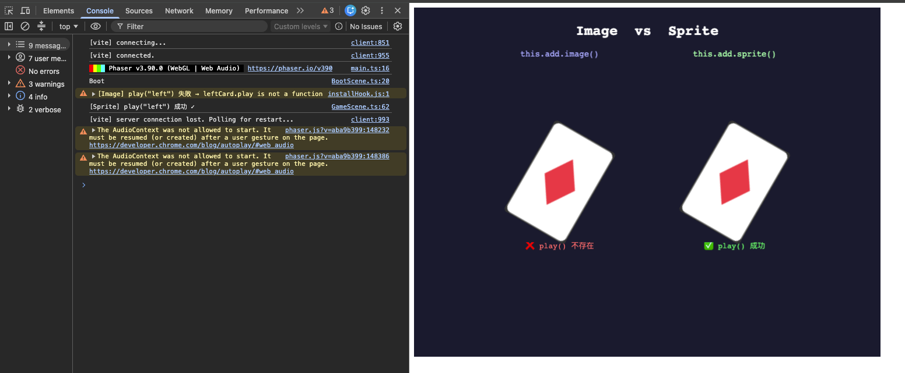

# Day02：Game Object - Image(靜態圖片) vs Sprite(可以動的圖片)

> 📆 2026-07-21

# 今日目標

理解 Phaser Game Object，知道什麼時候使用 Image、什麼時候使用 Sprite，並熟悉最常用的 Transform 屬性。

# 今日知識

## Game Object

用途：

- 從程式碼來看，`this.add.image(x, y, texture, frame)` 會建立一個新的 `Phaser.GameObjects.Image`（遊戲物件），把它加入目前 Scene 的顯示列表（Display List），並回傳這個物件。

## Image vs Sprite

| 功能             | Image | Sprite |
| ---------------- | ----- | ------ |
| 顯示圖片         | ✅    | ✅     |
| Scale            | ✅    | ✅     |
| Rotation / Angle | ✅    | ✅     |
| Flip             | ✅    | ✅     |
| Tint             | ✅    | ✅     |
| Tween            | ✅    | ✅     |
| Animation        | ❌    | ✅     |

# 完成畫面



# Git Commit

feat(day02): image vs sprite

# 學會的 Phaser API

## Phaser.GameObjects.Image

```typescript
this.add.image(x, y, texture, frame)
```

## Phaser.GameObjects.Sprite

```typescript
this.add.sprite(x, y, texture, frame)
```

## Phaser.GameObjects.Image.setScale()

```typescript
this.add.image(x, y, texture, frame).setScale(1.5)
```

## Phaser.GameObjects.Image.setAngle()

```typescript
this.add.image(x, y, texture, frame).setAngle(30)
```

## Phaser.GameObjects.Image.setFlipX()

```typescript
this.add.image(x, y, texture, frame).setFlipX(true)
```

## Phaser.GameObjects.Image.setFlipY()

```typescript
this.add.image(x, y, texture, frame).setFlipY(true)
```

# Reflection

今天最難？

1. 圖形 API 的用法，最後只能請 AI 教我怎麼畫出撲克牌
2. 因為要開啟給大家看學習進度，所以拆架構，發現跟 Vue 專案不同概念也不一樣，所以只能每個遊戲自己一個 vite，就解決了。

今天最大的收穫？
熟悉 Image 和 Sprite 的原型鏈和繼承結果，才知道為什麼 Image 不會有 play()，必須用 Sprite 才能有 play()。

明天要改善什麼？

1. 因為要畫撲克牌，看 Image 和 Sprite 以及連續下 setScale vs setDisplaySize，所以很多行別的地方只能先暫時讓程式碼紅紅
2. 沒有使用 TypeScript Type，所以產生不少問題。

# 明日預告

加入 Input。
